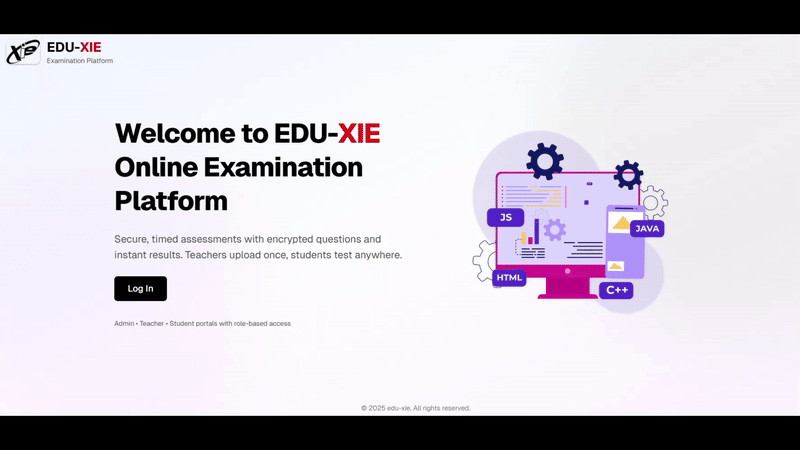

# 🎓 Online Examination System

A modern, secure, and feature-rich online examination platform built with **Next.js 16**, **MongoDB**, and **TypeScript**. Perfect for educational institutions, training centers, and organizations conducting online assessments.

<div align="center">
  
</div>


## ✨ Features

### 🔐 Multi-Role Authentication System

- **Super Admin**: Complete system control and user management
- **Admin**: User management, test assignments, and system analytics
- **Teacher**: Test creation, question management, and student performance tracking
- **Student**: Test taking, progress tracking, and answer review

### 📝 Advanced Test Management

- **Flexible Test Creation**: Create tests with custom duration, scheduling, and student assignments
- **Question Import**: Support for Word (.docx) and PowerPoint (.pptx) file uploads
- **Template Generation**: Download formatted templates for question creation
- **Terms & Conditions**: Configurable terms that students must accept before starting tests
- **Anti-Cheat Measures**: Fullscreen mode, tab switching detection, and time tracking

### 🎯 Smart Question Handling

- **Multiple Choice Questions (MCQ)**: Automated parsing from uploaded files
- **Encrypted Storage**: Questions and answers stored with AES encryption
- **Auto-Grading**: Instant scoring and feedback
- **Review System**: Students can review their answers after test completion

### 📊 Comprehensive Analytics

- **Real-time Dashboards**: Performance metrics for all user roles
- **Progress Tracking**: Individual and class-wide performance analysis
- **Visual Charts**: Interactive charts using Recharts library
- **Export Capabilities**: Download results and user data

### 🎨 Modern User Experience

- **Responsive Design**: Optimized for desktop, tablet, and mobile devices
- **Dark/Light Theme**: Built-in theme switching with next-themes
- **Animated UI**: Smooth animations using Framer Motion
- **Interactive Elements**: Lottie animations and modern UI components

### 🔒 Security Features

- **JWT Authentication**: Secure session management
- **Password Encryption**: bcrypt hashing with configurable salt rounds
- **Role-based Access Control**: Fine-grained permissions system
- **Data Encryption**: Sensitive data protected with crypto-js
- **Session Management**: Automatic token validation and refresh

## 🚀 Quick Start

### Prerequisites

- Node.js 18+
- MongoDB database
- npm/yarn/pnpm/bun package manager

### Installation

1. **Clone the repository**

```bash
git clone https://github.com/Manav-Chudasama/online-examination-system.git
cd online-examination-system
```

2. **Install dependencies**

```bash
npm install
# or
yarn install
# or
pnpm install
# or
bun install
```

3. **Environment Setup**
   Create a `.env.local` file in the root directory:

```env
# Database
MONGODB_URI=mongodb://localhost:27017/online-examination-system

# Authentication
JWT_SECRET=your-super-secret-jwt-key
JWT_EXPIRES_IN=7d
COOKIE_NAME=oex_session
COOKIE_SECURE=false
BCRYPT_SALT_ROUNDS=12

# Encryption
ENCRYPTION_KEY=your-32-character-encryption-key

# Google AI (Optional - for chatbot features)
GOOGLE_AI_API_KEY=your-google-ai-api-key
```

4. **Run the development server**

```bash
npm run dev
# or
yarn dev
# or
pnpm dev
# or
bun dev
```

5. **Open your browser**
   Navigate to [http://localhost:3000](http://localhost:3000)

## 🏗️ Project Structure

```
src/
├── app/                    # Next.js App Router
│   ├── admin/             # Admin dashboard and management
│   ├── teacher/           # Teacher interface and tools
│   ├── student/           # Student dashboard and test interface
│   ├── api/               # API routes and endpoints
│   │   ├── auth/          # Authentication endpoints
│   │   ├── admin/         # Admin-specific APIs
│   │   ├── teacher/       # Teacher-specific APIs
│   │   └── student/       # Student-specific APIs
│   └── globals.css        # Global styles
├── components/            # Reusable UI components
│   ├── ui/               # Base UI components (buttons, inputs, etc.)
│   └── test/             # Test-specific components
├── lib/                  # Utility libraries
│   ├── auth.ts           # Authentication utilities
│   ├── encryption.ts     # Data encryption/decryption
│   ├── mongoose-connect.ts # Database connection
│   └── utils.ts          # General utilities
├── models/               # MongoDB/Mongoose schemas
│   ├── User.ts          # User model with roles
│   ├── Test.ts          # Test/Exam model
│   ├── Question.ts      # Question model with encryption
│   ├── Result.ts        # Test results and submissions
│   └── TermsTemplate.ts # Terms and conditions
└── LottieFiles/         # Animation assets
```

## 📋 API Endpoints

### Authentication

- `POST /api/auth/login` - User login
- `GET /api/auth/me` - Get current user
- `POST /api/auth/logout` - User logout

### Admin APIs

- `GET /api/admin/dashboard` - System analytics
- `GET /api/admin/users` - User management
- `POST /api/admin/users/bulk` - Bulk user import
- `GET /api/admin/assignments` - Test assignments

### Teacher APIs

- `GET /api/teacher/dashboard` - Teacher analytics
- `GET /api/teacher/tests` - Test management
- `POST /api/teacher/upload/questions` - Question upload
- `GET /api/teacher/results` - Student results
- `GET /api/teacher/terms` - Terms & conditions management

### Student APIs

- `GET /api/student/dashboard` - Student dashboard
- `GET /api/student/assignments/today` - Today's assignments
- `POST /api/student/tests/[id]/submit-question` - Submit answer
- `POST /api/student/tests/[id]/submit-final` - Submit test
- `GET /api/student/review/[id]` - Review test answers

## 👥 User Roles & Permissions

### Super Admin

- Complete system access
- Create/manage admins
- System configuration
- All data access

### Admin

- Manage teachers and students
- Assign tests to students
- View system analytics
- Bulk user operations
- Download reports

### Teacher

- Create and manage tests
- Upload questions via file import
- Set terms and conditions
- View student performance
- Generate templates
- Real-time test monitoring

### Student

- Take assigned tests
- View progress and results
- Review completed test answers
- Access personal dashboard
- Accept terms before tests

## 🔧 Configuration

### Database Models

**User Model**

- Multi-role support (superadmin, admin, teacher, student)
- Profile management with subjects and assignments
- Account status and suspension tracking
- Audit trail with creation and modification tracking

**Test Model**

- Flexible scheduling with start/end times
- Student assignment management
- Duration control and time limits
- Status tracking (draft, active, completed)
- Terms and conditions integration

**Question Model**

- Encrypted question storage
- Support for multiple choice questions
- Automatic answer validation
- Bulk import capabilities

**Result Model**

- Detailed answer tracking
- Real-time progress monitoring
- Comprehensive scoring system
- Performance analytics

### Security Configuration

**Authentication**

- JWT-based session management
- Configurable token expiration
- Secure cookie handling
- Role-based route protection

**Encryption**

- AES encryption for sensitive data
- Configurable encryption keys
- Secure password hashing
- Data integrity protection

## 🎨 UI/UX Features

### Design System

- **Tailwind CSS**: Utility-first styling
- **Shadcn/ui**: High-quality component library
- **Lucide Icons**: Beautiful, consistent iconography
- **Responsive Design**: Mobile-first approach

### Interactive Elements

- **Lottie Animations**: Engaging micro-interactions
- **Framer Motion**: Smooth page transitions
- **Theme Support**: Dark/light mode switching
- **Toast Notifications**: User feedback with Sonner

### Accessibility

- Keyboard navigation support
- Screen reader compatibility
- High contrast color schemes
- ARIA labels and descriptions

## 📱 Mobile Responsiveness

The system is fully responsive with optimized layouts for:

- **Mobile phones** (320px+): Stacked cards, full-width buttons
- **Tablets** (768px+): Grid layouts, compact navigation
- **Desktops** (1024px+): Full dashboard layouts, side navigation

### Responsive Features

- Adaptive stat grids (2 → 3 → 6 columns)
- Mobile-optimized test interface
- Touch-friendly controls
- Optimized typography scaling

## 🧪 Testing & Quality

### Code Quality

- **Biome**: Lightning-fast linting and formatting
- **TypeScript**: Type safety and better development experience
- **ESLint**: Additional code quality checks

### File Processing

- **mammoth**: Word document parsing
- **pptxgenjs**: PowerPoint processing
- **JSZip**: Archive file handling
- **ExcelJS**: Spreadsheet operations

## 🔄 Development Workflow

### Scripts

```bash
npm run dev      # Start development server
npm run build    # Build for production
npm run start    # Start production server
npm run lint     # Run linting
npm run format   # Format code
```

### File Upload Support

- **Word (.docx)**: Question import with formatting
- **PowerPoint (.pptx)**: Slide-based question extraction
- **Excel (.xlsx)**: Bulk user import
- **CSV**: Alternative bulk import format

## 🚀 Deployment

### Production Build

```bash
npm run build
npm start
```

### Environment Variables

Ensure all production environment variables are configured:

- Database connection strings
- JWT secrets and encryption keys
- API keys for external services
- Cookie security settings

### Recommended Hosting

- **Vercel**: Optimized for Next.js (recommended)
- **Netlify**: Static site hosting with serverless functions
- **AWS**: Full control with EC2/Lambda
- **Digital Ocean**: Droplets or App Platform

## 🤝 Contributing

1. Fork the repository
2. Create a feature branch (`git checkout -b feature/amazing-feature`)
3. Commit your changes (`git commit -m 'Add amazing feature'`)
4. Push to the branch (`git push origin feature/amazing-feature`)
5. Open a Pull Request

### Development Guidelines

- Follow TypeScript best practices
- Use conventional commits
- Add appropriate tests
- Update documentation
- Ensure mobile responsiveness

## 📄 License

This project is licensed under the MIT License - see the [LICENSE](LICENSE) file for details.

## 👨‍💻 Author

**Manav Chudasama**

- GitHub: [@Manav-Chudasama](https://github.com/Manav-Chudasama)
- Project: [Online Examination System](https://github.com/Manav-Chudasama/online-examination-system)

## 🙏 Acknowledgments

- [Next.js Team](https://nextjs.org/) for the amazing framework
- [Vercel](https://vercel.com/) for deployment platform
- [Tailwind CSS](https://tailwindcss.com/) for the styling system
- [Shadcn/ui](https://ui.shadcn.com/) for beautiful components
- [MongoDB](https://www.mongodb.com/) for the database solution

---

<p align="center">Made with ❤️ for educational excellence</p>
